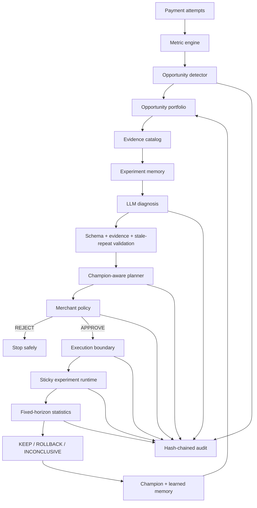

# Razorpay Merchant Revenue Autopilot

**A learning revenue-optimization agent for Razorpay merchants where AI may propose an experiment, but deterministic policy controls authorization and fixed-horizon statistics controls promotion.**

Merchant Revenue Autopilot turns payment-conversion evidence into bounded optimization cycles. It detects conversion leakage, ranks eligible opportunities, gives an evidence-grounded LLM structured merchant history, plans a controlled experiment, gates it through deterministic merchant policy, executes through an explicit Razorpay boundary, measures the treatment at a fixed sample horizon, and learns from the terminal result without deleting prior history.

**Live demo:** https://merchant-revenue-autopilot-psi.vercel.app  
**Merchant Intelligence:** https://merchant-revenue-autopilot-psi.vercel.app/intelligence  
**Backend health:** https://merchant-revenue-autopilot-api.onrender.com/health  
**Canonical evaluation:** [`docs/evaluation/summary.md`](docs/evaluation/summary.md)  
**Production verification:** [`docs/PRODUCTION_VERIFICATION.md`](docs/PRODUCTION_VERIFICATION.md)

## Core principle

> **AI proposes. Deterministic policy authorizes. The execution boundary acts. Statistics decides. Persisted outcomes shape the next cycle.**

```text
Merchant-visible payment data
        ↓
Metric engine + opportunity detector
        ↓
Deterministic opportunity portfolio
        ↓
Persisted experiment memory
        ↓
Evidence-grounded LLM diagnosis
        ↓
Deterministic stale-repeat validation
        ↓
Champion-aware experiment planner
        ↓
Merchant policy gate
        ↓
Razorpay execution boundary
        ↓
Fixed-horizon experiment runtime
        ↓
KEEP / ROLLBACK / INCONCLUSIVE
        ↓
Champion state + learned memory + hash-chained audit
        ↓
Next optimization cycle
```

The LLM never decides whether an experiment is safe, never emits raw Razorpay request JSON, never calls Razorpay directly, and never decides whether its treatment won.

## What makes the system adaptive

### 1. Structured merchant experiment memory

Terminal experiments are reconstructed from the existing experiment, policy, result, and resource tables. There is no second mutable “AI memory” database.

The memory layer records, per segment and intervention:

- treatment configuration and deterministic fingerprint
- merchant-policy outcome
- KEEP / ROLLBACK / INCONCLUSIVE result
- absolute and relative lift
- p-value and confidence interval
- execution-resource state
- previous trial counts

Active work is excluded until it reaches a safe terminal boundary.

### 2. Deterministic opportunity portfolio

Untouched opportunities are ranked without an LLM. The ranker uses observable conversion gap, affected volume, captured average order value, merchant-policy feasibility, and prior terminal-trial history.

The history factor is transparent:

```text
history_factor = 1 / (1 + prior_terminal_trials)
```

The resulting GMV value is labelled an **opportunity-sizing proxy**. It is not predicted revenue, booked revenue, profit, or a causal uplift claim.

Partially started cycles always resume before any new candidate is ranked.

### 3. Memory-aware diagnosis

The LLM receives compact prior experiment history for the affected merchant segment. Deterministic code then prevents an exact stale semantic proposal from being persisted:

- an exact prior policy-rejected proposal stays blocked;
- an exact prior ROLLBACK/INCONCLUSIVE proposal is blocked when observable evidence has not materially changed;
- reconsideration is allowed only after explicit material evidence change, such as a >=2 percentage-point rate movement or substantial new segment observations.

If a valid structured proposal is rejected as a stale repeat, the diagnosis boundary permits one bounded corrective LLM attempt. Nothing is persisted until the proposal passes schema, evidence, semantic, and memory checks.

### 4. Champion–challenger state

Champion state is derived from real statistical `KEEP` results rather than a mutable flag.

- baseline merchant configuration starts as Champion v1;
- only a KEEP treatment can be promoted;
- later experiments of the same intervention type inherit the current champion as their control;
- ROLLBACK and INCONCLUSIVE leave the champion unchanged;
- a challenger identical to the current champion is rejected as meaningless.

### 5. Merchant Intelligence console

`/intelligence` exposes only persisted deterministic truth:

- current champion and promoted configurations
- terminal trial counts
- policy rejection counts
- opportunity portfolio / next-best candidate when one exists
- learned segment × intervention history
- newest terminal experiment outcomes

React does not recompute ranking, memory, or champion logic.

## Why this is different

| Risk in a naive AI growth agent | Revenue Autopilot boundary |
| --- | --- |
| Hallucinated reasoning becomes action | Strict structured output + evidence-reference validation |
| Agent repeats failed ideas forever | Persisted experiment memory + deterministic stale-repeat validation |
| Model chooses what to optimize using opaque intuition | Deterministic opportunity portfolio |
| Model chooses unsafe financial parameters | Deterministic merchant policy |
| Retried external writes create duplicates | Application-level operation ledger + ambiguous-write protection |
| Agent declares its own idea successful | Fixed-horizon statistics alone decides KEEP / ROLLBACK / INCONCLUSIVE |
| A past winner is forgotten | KEEP-derived champion state becomes the future control |
| Benchmark leaks the hidden answer | Strategy selection happens before sealed causal scoring |
| Demo history is hard to trust | Append-only application events + SHA-256 hash chain |

## Trust architecture



See [`docs/ARCHITECTURE.md`](docs/ARCHITECTURE.md) for the detailed trust boundaries.

## Hosted demo disclosure

The public demo uses **`RAZORPAY_EXECUTION_MODE=simulated`** because merchant Test Mode API credentials require Razorpay account onboarding/KYC that was unavailable for this submission account.

This is intentionally visible in the product. Simulated resources use `demo_...` IDs and the UI states that no Razorpay API request was made and the resource does not exist in the Razorpay dashboard.

The repository still contains the real Razorpay Test Mode client and executor path for Payment Links and Orders. Real mode requires `rzp_test_...` credentials; live-mode keys are not accepted by the demo workflow.

The hosted LLM boundary uses the OpenAI-compatible SDK and is currently routed through OpenRouter. Provider output is validated after generation.

## Current production-verified state

Task 20 ran a third adaptive optimization cycle against the hosted deployment and completed successfully.

Current live learning state:

- terminal trials: **3**
- statistical outcomes: **3 INCONCLUSIVE**
- policy rejections: **0** in the hosted history
- promoted treatments: **0**
- current champion: **v1 / merchant baseline**
- audit chain: **verified**

The third verified cycle used opportunity `0e500ccd-6c3d-4ade-a06c-afc3d2cd24e6` and experiment `5277a2df-c1a5-4009-9320-c97c3576ff38`.

The live LLM explicitly reasoned over prior experiment history and proposed `payment_method_config` after the observable android_budget evidence had materially changed. The deterministic memory guard accepted reconsideration under that changed evidence instead of treating it as an unqualified stale repeat.

Final fixed-horizon result:

| Metric | Result |
| --- | ---: |
| Control samples | 1,895 |
| Treatment samples | 200 |
| Control conversion | 47.2% |
| Treatment conversion | 45.5% |
| Absolute lift | -1.7 pp |
| p-value | 0.6412 |
| 95% CI | -9.0 pp to +5.5 pp |
| Decision | `INCONCLUSIVE` |

Because the result was not KEEP, Champion v1 correctly remained unchanged. The terminal trial was added to experiment memory exactly once.

Task 20's guarded production verifier also confirmed:

- previous trial count 2 -> new trial count 3
- previous champion v1 -> new champion v1
- memory-aware hypothesis validation passed
- champion-control validation passed
- active-cycle rollover protection returned HTTP 409
- simulated resource namespace was used
- audit-chain integrity remained valid
- prior history remained persisted

The hosted demo resource for the latest cycle is `demo_plink_0a6348797891d7c8`.

Do not interpret this resource as a real Razorpay dashboard object.

## Deterministic evaluation

A separate frozen benchmark compares four strategies on identical paired synthetic cohorts:

- `NO_OPTIMIZATION`
- `RANDOM_INTERVENTION`
- `RULE_BASED`
- `AUTOPILOT`

Canonical configuration:

- 5 fixed seeds
- 5 merchant segments
- 5,000 contexts per segment per seed
- paired contexts across strategies
- frozen causal-model fingerprint `05642a18eb14a7d4a0ff3beebf892253f3eed68efeea4f25cd56237c64e0750d`

| Strategy | Mean conversion | Mean delta vs control |
| --- | ---: | ---: |
| **AUTOPILOT** | **59.39%** | **+1.22 pp** |
| RANDOM_INTERVENTION | 59.20% | +1.02 pp |
| NO_OPTIMIZATION | 58.18% | 0.00 pp |
| RULE_BASED | 57.65% | -0.52 pp |

Autopilot recorded 5 policy rejections in the frozen evaluation rather than forcing every proposal into deployment.

These are **synthetic deterministic benchmark results, not production revenue claims**.

Run the benchmark locally:

```bash
python scripts/run_evaluation.py
```

## Product flow

1. **Observe** — compute attempts, capture/failure/abandonment, conversion, GMV, segment and payment-method metrics.
2. **Detect** — identify conversion divergence using deterministic thresholds.
3. **Prioritize** — rank untouched opportunities using the deterministic portfolio.
4. **Remember** — reconstruct terminal experiment knowledge from persisted truth.
5. **Diagnose** — ask the LLM for an evidence-grounded structured hypothesis with prior trial context.
6. **Validate** — schema, evidence, semantic, and stale-repeat checks run before persistence.
7. **Plan** — create a canonical experiment; use a promoted champion as control when one exists.
8. **Authorize** — merchant policy returns APPROVE or REJECT; there is no override button.
9. **Execute** — deploy through a locally idempotent Razorpay execution boundary.
10. **Measure** — deterministic sticky assignment runs until both fixed-horizon sample targets are met.
11. **Decide** — statistics emits KEEP, ROLLBACK, or INCONCLUSIVE.
12. **Learn** — terminal history updates memory; KEEP alone advances champion state.
13. **Audit** — every meaningful lifecycle transition is linked in the merchant hash chain.

## Repeatable optimization cycles

A completed or safely stopped cycle does not require a database reset.

**Start New Optimization Cycle**:

- preserves prior opportunities, experiments, results, resources, attempts, and audit events;
- resolves the finished opportunity rather than deleting it;
- resumes partially completed work before considering a new candidate;
- uses the portfolio when untouched detected candidates exist;
- otherwise permits fresh deterministic detection;
- refuses rollover while a deployed/running/evaluation/rollback cycle is active.

## Frontend

The Next.js operations console exposes:

- `/overview` — merchant metrics, current lifecycle state, segment/payment-method evidence, recent activity
- `/intelligence` — champion state, learned experiment memory, opportunity portfolio, terminal trials
- `/autopilot` — current and historical optimization cycles
- `/autopilot/[opportunityId]` — evidence -> AI -> plan -> policy -> execution -> statistics detail
- `/audit` — expandable hash-chained audit history

The cycle detail page visibly separates **Observed Evidence** from **AI Analysis**, labels simulated hosted resources, and identifies the final decision as statistical rather than AI-generated.

## API

Core public routes under `/api/v1` include:

| Method | Path | Purpose |
| --- | --- | --- |
| `GET` | `/api/v1/merchants/{merchant_id}/overview` | Merchant metrics and current lifecycle state |
| `GET` | `/api/v1/merchants/{merchant_id}/intelligence` | Portfolio, champion and learned experiment memory |
| `GET` | `/api/v1/merchants/{merchant_id}/opportunities` | Persisted opportunities |
| `GET` | `/api/v1/opportunities/{opportunity_id}/cycle` | Complete lifecycle read model |
| `GET` | `/api/v1/merchants/{merchant_id}/audit` | Merchant audit history |
| `POST` | `/api/v1/merchants/{merchant_id}/detect` | Detect opportunities |
| `POST` | `/api/v1/opportunities/{opportunity_id}/diagnose` | Generate + validate diagnosis |
| `POST` | `/api/v1/hypotheses/{hypothesis_id}/plan` | Create experiment plan |
| `POST` | `/api/v1/experiments/{experiment_id}/policy` | Evaluate merchant policy |
| `POST` | `/api/v1/experiments/{experiment_id}/deploy` | Deploy through configured execution mode |
| `POST` | `/api/v1/experiments/{experiment_id}/run` | Run one experiment batch |
| `POST` | `/api/v1/experiments/{experiment_id}/evaluate` | Produce fixed-horizon decision |
| `POST` | `/api/v1/experiments/{experiment_id}/rollback` | Cancel treatment after ROLLBACK |
| `POST` | `/api/v1/merchants/{merchant_id}/autopilot/step` | Advance one legal lifecycle transition |
| `GET` | `/health` | Health check |

The dashboard also uses the intentionally non-OpenAPI control endpoint `POST /api/v1/merchants/{merchant_id}/autopilot/new-cycle` for explicit lifecycle rollover.

## Local development

### Backend

Requires Python 3.12+.

```bash
cd backend
python -m venv .venv
# Windows: .venv\Scripts\activate
# macOS/Linux: source .venv/bin/activate
pip install -e ".[dev]"
uvicorn app.main:app --reload
```

From the repository root, create missing canonical demo rows non-destructively:

```bash
python scripts/bootstrap_demo.py
```

### Frontend

```bash
cd frontend
npm ci
npm run dev
```

Default local frontend: `http://localhost:3000`  
Default local backend: `http://localhost:8000`

## Configuration

Backend:

```text
APP_ENV=production
DATABASE_URL=<PostgreSQL or SQLite URL>
CORS_ALLOWED_ORIGINS=<comma-separated frontend origins>
OPENAI_API_KEY=<LLM provider key>
OPENAI_BASE_URL=<optional OpenAI-compatible base URL>
OPENAI_MODEL=<model or router name>
RAZORPAY_EXECUTION_MODE=real|simulated
RAZORPAY_KEY_ID=<required in real mode>
RAZORPAY_KEY_SECRET=<required in real mode>
RAZORPAY_TEST_OFFER_ID=<optional verified pre-created test Offer ID>
```

Frontend:

```text
NEXT_PUBLIC_API_BASE_URL=<backend HTTPS origin>
API_INTERNAL_BASE_URL=<backend HTTPS origin>
```

Never put backend secrets in `NEXT_PUBLIC_` variables.

## Deployment

Current hosted stack:

- frontend: Vercel
- backend: Render
- database: Supabase PostgreSQL
- LLM: OpenAI-compatible SDK, hosted demo routed through OpenRouter
- payment execution: explicit simulated hosted adapter; real Razorpay Test Mode path remains implemented

Read-only smoke test:

```bash
BASE_URL=https://merchant-revenue-autopilot-api.onrender.com python scripts/smoke_deployment.py
```

## Verification

Backend:

```bash
cd backend
pytest -q
```

Frontend:

```bash
cd frontend
npm test
npm run lint
npm run typecheck
npm run build
```

Task 20 adaptive production verification is implemented in `scripts/verify_production_v2.py` and guarded by `.github/workflows/production-verification.yml`. It is intentionally write-capable and should not be rerun casually after submission freeze.

## Failure behavior worth testing

The system fails closed for:

- missing/malformed LLM configuration
- malformed structured model output
- invalid evidence references
- stale exact failed/inconclusive proposals without material evidence change
- exact policy-rejected repeats
- disallowed intervention or invalid treatment configuration
- excessive exposure/discount/financial exposure
- unmapped Offer IDs
- ambiguous external writes
- insufficient sample horizon
- active-cycle rollover attempts
- challenger identical to current champion

## Repository map

```text
backend/app/engines/        detector, diagnosis, planner, policy, statistics
backend/app/services/       orchestration, memory, portfolio, champion, executor, audit, cycles
backend/app/simulation/     deterministic merchant world + sealed causal model
backend/app/evaluation/     paired benchmark and report generation
backend/app/api/            FastAPI routes and typed public schemas
frontend/                   Next.js operations console + Merchant Intelligence
scripts/                    bootstrap, smoke, evaluation, production verification
docs/evaluation/            committed benchmark summary and full JSON
```

## Submission material

- [`docs/ARCHITECTURE.md`](docs/ARCHITECTURE.md) — trust + adaptive architecture
- [`docs/PRODUCTION_VERIFICATION.md`](docs/PRODUCTION_VERIFICATION.md) — hosted release evidence including Task 20
- [`docs/DEMO_SCRIPT.md`](docs/DEMO_SCRIPT.md) — judge demo flow
- [`docs/SUBMISSION.md`](docs/SUBMISSION.md) — submission-ready copy
- [`docs/JUDGE_QA.md`](docs/JUDGE_QA.md) — judge-facing technical Q&A
- [`docs/evaluation/summary.md`](docs/evaluation/summary.md) — frozen benchmark

## Limitations

- Hosted Razorpay execution is simulated and clearly labelled because Test Mode credentials were unavailable without merchant onboarding/KYC.
- The benchmark is synthetic and deterministic; it is not evidence of production merchant uplift.
- The benchmark diagnosis adapter is deterministic for reproducibility and does not use live OpenRouter output.
- Champion behavior is implemented and verified, but the hosted merchant remains Champion v1 because no live treatment has earned a KEEP result.
- The current product demonstrates one canonical merchant profile rather than complete multi-tenant onboarding.
- The hash chain is an application-level tamper-evidence mechanism, not a distributed ledger.
