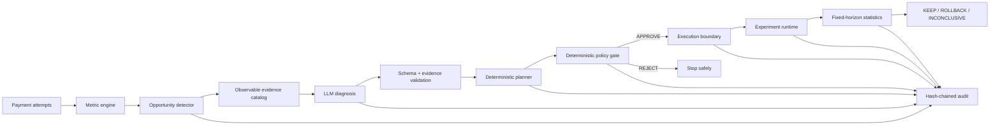

# Razorpay Merchant Revenue Autopilot

**An AI revenue agent that can propose experiments, but cannot authorize itself, bypass merchant policy, or decide its own success.**

Merchant Revenue Autopilot detects conversion leakage in payment data, asks an LLM for a structured hypothesis, converts that hypothesis into a bounded experiment, applies deterministic merchant-policy checks, executes through a Razorpay boundary, measures a fixed-horizon experiment, and records the complete lifecycle in a tamper-evident audit chain.

**Live demo:** https://merchant-revenue-autopilot-psi.vercel.app  
**Backend health:** https://merchant-revenue-autopilot-api.onrender.com/health  
**Canonical evaluation:** [`docs/evaluation/summary.md`](docs/evaluation/summary.md)  
**Full evaluation JSON:** [`docs/evaluation/report.json`](docs/evaluation/report.json)

## Core principle

> **AI proposes. Deterministic policy authorizes. The execution boundary acts. Statistics decides.**

```text
Payment data
   ↓
Metric engine
   ↓
Opportunity detector
   ↓
Evidence-grounded LLM diagnosis
   ↓
Deterministic experiment planner
   ↓
Merchant policy gate
   ↓
Razorpay execution boundary
   ↓
Fixed-horizon experiment runtime
   ↓
KEEP / ROLLBACK / INCONCLUSIVE
   ↓
Hash-chained audit history
```

The LLM never decides whether an experiment is safe, never emits raw Razorpay request JSON, never calls Razorpay directly, and never decides whether a treatment won.

## Why this is different

| Risk in a naive AI growth agent | Revenue Autopilot boundary |
| --- | --- |
| Hallucinated reasoning becomes an action | LLM output must pass strict schema and evidence-reference validation |
| Model chooses unsafe financial parameters | Deterministic merchant policy approves or rejects the full experiment |
| Retried external writes create duplicates | Local operation ledger provides application-level idempotency and ambiguous-write protection |
| Agent declares its own idea successful | Fixed-horizon statistics alone produces KEEP, ROLLBACK, or INCONCLUSIVE |
| Evaluation leaks the hidden answer into selection | Strategy selection occurs before the sealed causal model is used for scoring |
| Demo history becomes hard to trust | Lifecycle events are append-only at the application layer and SHA-256 hash-chained |

## Architecture



Hosted stack:

```text
Vercel Next.js frontend
        ↓ HTTPS
Render FastAPI backend
        ↓
Supabase PostgreSQL
        ↓
OpenAI-compatible LLM boundary

Execution boundary:
- real mode: Razorpay Test Mode API
- hosted demo mode: explicit simulated resource adapter
```

See [`docs/ARCHITECTURE.md`](docs/ARCHITECTURE.md) for trust boundaries and failure behavior.

## Repeatable optimization cycles

A completed or safely stopped optimization cycle does **not** require a database reset.

The dashboard exposes **Start New Optimization Cycle**. Starting another cycle:

- preserves previous opportunities, experiments, statistical results, payment attempts, resources, and audit events;
- resolves the finished opportunity rather than deleting it;
- reuses another already-detected opportunity before running detection again;
- allows an approved but never-deployed experiment to be explicitly abandoned and marked cancelled;
- refuses rollover while a deployed/running/evaluation/rollback cycle is still active.

This keeps judge/demo runs repeatable while preserving the evidence trail from earlier cycles.

## Hosted demo disclosure

The public demo uses **`RAZORPAY_EXECUTION_MODE=simulated`** because merchant Test Mode API credentials require Razorpay account onboarding/KYC that is not available for this submission account.

This is intentionally visible in the product. Simulated resources use `demo_...` IDs and the UI states that no Razorpay API request was made and that the resource does not exist in the Razorpay dashboard.

The repository still contains the real Razorpay Test Mode client and executor path. Real mode requires `rzp_test_...` credentials; live-mode keys are not accepted by the demo workflow.

The hosted LLM path is OpenAI-compatible and is currently configured through OpenRouter. Model output is validated after generation, so the diagnosis boundary remains provider-compatible.

## Deterministic evaluation

The repository contains a sealed, reproducible benchmark comparing four strategies on the same paired synthetic cohorts:

- `NO_OPTIMIZATION`
- `RANDOM_INTERVENTION`
- `RULE_BASED`
- `AUTOPILOT`

Canonical benchmark configuration:

- 5 fixed seeds
- 5 canonical merchant segments
- 5,000 contexts per segment per seed
- paired contexts across strategies
- frozen causal-model fingerprint `05642a18eb14a7d4a0ff3beebf892253f3eed68efeea4f25cd56237c64e0750d`

### Overall result

| Strategy | Mean conversion | Mean delta vs control |
| --- | ---: | ---: |
| **AUTOPILOT** | **59.39%** | **+1.22 pp** |
| RANDOM_INTERVENTION | 59.20% | +1.02 pp |
| NO_OPTIMIZATION | 58.18% | 0.00 pp |
| RULE_BASED | 57.65% | -0.52 pp |

Autopilot recorded **5 policy rejections** rather than deploying every proposal. Random intervention had 7 rejections and the rule baseline had 10.

The strongest Autopilot segment in the frozen world is `repeat_buyer`, where mean conversion improved from **66.82% to 72.34%**, a **+5.52 pp** mean delta across the five seeds.

These are **synthetic deterministic evaluation results, not production revenue claims**. Captured GMV in the report is not profit, ROI, net revenue, or observed merchant uplift.

Run the benchmark locally:

```bash
python scripts/run_evaluation.py
```

## Product flow

### 1. Observe
The metric engine computes attempts, captures, failures, abandonment, conversion, captured GMV, segment metrics, payment-method metrics, and failure reasons from merchant-visible payment data.

### 2. Detect
The opportunity detector compares a target segment with the combined comparison cohort using deterministic thresholds. It does not use the LLM or the sealed evaluation model.

### 3. Diagnose
The LLM receives only the evidence catalog for the detected opportunity and returns a schema-constrained `HypothesisProposal`. Unsupported intervention parameters, malformed proposals, and unknown evidence references are rejected.

### 4. Plan
The deterministic planner creates canonical control/treatment configuration, traffic exposure, primary metric, guardrails, sample size, and duration.

### 5. Authorize
The policy engine checks intervention allow-list, treatment exposure, discount limits, financial exposure, minimum sample, duration, concurrency, segment conflict, and configuration validity. There is no policy override button.

### 6. Execute
The executor requires a persisted `APPROVE` policy decision and uses `operation_executions` for application-level idempotency. Ambiguous network failures remain unresolved and are not automatically retried.

### 7. Measure
Control/treatment assignment is deterministic and sticky. The experiment waits for both variants to reach the fixed sample horizon.

### 8. Decide
The statistical engine uses a two-proportion z-test plus a practical-lift threshold:

- significant positive lift at or above +2 percentage points: `KEEP`
- significant negative lift at or below -2 percentage points: `ROLLBACK`
- otherwise: `INCONCLUSIVE`

The LLM is not involved in this decision.

### 9. Audit
Detection, diagnosis, planning, policy, execution, runtime, statistics, and rollback events are linked per merchant with SHA-256 hashes. The dashboard verifies audit-chain integrity.

## Demo merchant

The canonical merchant is **TechBazaar Electronics**, a deterministic synthetic consumer-electronics merchant profile used for the demo and benchmark.

The baseline contains 6,112 payment attempts. Experiment runs append simulated experimental traffic, so dashboard totals increase over time without deleting earlier cycles.

## Frontend

The Next.js frontend lives under `frontend/` and uses a compact operations-console design rather than an AI chat UI.

Routes:

- `/overview` — merchant metrics, segment conversion, payment-method performance, current Autopilot state, and recent audit events
- `/autopilot` — current and historical optimization cycles
- `/autopilot/[opportunityId]` — evidence-to-decision lifecycle
- `/audit` — expandable hash-chained audit history

The cycle detail page explicitly separates **observed evidence** from **LLM analysis**, shows deterministic policy authorization, labels simulated hosted-demo resources, hides interim experiment statistics, and identifies the final decision as statistical rather than AI-generated.

## API

Core public product routes live under `/api/v1`:

| Method | Path | Purpose |
| --- | --- | --- |
| `GET` | `/api/v1/merchants/{merchant_id}/overview` | Merchant metrics and current Autopilot state |
| `GET` | `/api/v1/merchants/{merchant_id}/opportunities` | Detected opportunities |
| `GET` | `/api/v1/opportunities/{opportunity_id}/cycle` | Complete persisted lifecycle read model |
| `GET` | `/api/v1/merchants/{merchant_id}/audit` | Merchant audit trail |
| `POST` | `/api/v1/merchants/{merchant_id}/detect` | Detect opportunities |
| `POST` | `/api/v1/opportunities/{opportunity_id}/diagnose` | Generate and validate diagnosis |
| `POST` | `/api/v1/hypotheses/{hypothesis_id}/plan` | Create deterministic experiment plan |
| `POST` | `/api/v1/experiments/{experiment_id}/policy` | Evaluate merchant policy |
| `POST` | `/api/v1/experiments/{experiment_id}/deploy` | Deploy treatment through configured execution mode |
| `POST` | `/api/v1/experiments/{experiment_id}/run` | Execute one synthetic runtime batch |
| `POST` | `/api/v1/experiments/{experiment_id}/evaluate` | Produce fixed-horizon statistical decision |
| `POST` | `/api/v1/experiments/{experiment_id}/rollback` | Cancel treatment after a rollback decision |
| `POST` | `/api/v1/merchants/{merchant_id}/autopilot/step` | Advance exactly one legal lifecycle transition |
| `GET` | `/health` | Health check |

`autopilot/step` advances at most one meaningful transition per request. It does not recursively call itself or skip safety gates.

The dashboard also uses an intentionally non-OpenAPI control endpoint, `POST /api/v1/merchants/{merchant_id}/autopilot/new-cycle`, for explicit lifecycle rollover after a terminal or safely undeployed cycle.

## Local development

### Backend

Requires Python 3.12 or newer.

```bash
cd backend
python -m venv .venv
# Windows: .venv\Scripts\activate
# macOS/Linux: source .venv/bin/activate
pip install -e ".[dev]"
uvicorn app.main:app --reload
```

From the repository root, create missing canonical demo rows non-destructively:

```bash
python scripts/bootstrap_demo.py
```

### Frontend

```bash
cd frontend
npm ci
npm run dev
```

Default local frontend: `http://localhost:3000`  
Default local backend: `http://localhost:8000`

## Configuration

Backend environment variables:

```text
APP_ENV=production
DATABASE_URL=<PostgreSQL or SQLite URL>
CORS_ALLOWED_ORIGINS=<comma-separated frontend origins>

OPENAI_API_KEY=<LLM provider key>
OPENAI_BASE_URL=<optional OpenAI-compatible base URL>
OPENAI_MODEL=<model or router name>

RAZORPAY_EXECUTION_MODE=real|simulated
RAZORPAY_KEY_ID=<required in real mode>
RAZORPAY_KEY_SECRET=<required in real mode>
RAZORPAY_TEST_OFFER_ID=<optional verified pre-created test Offer ID>
```

Frontend environment variables:

```text
NEXT_PUBLIC_API_BASE_URL=<backend HTTPS origin>
API_INTERNAL_BASE_URL=<backend HTTPS origin>
```

Never put backend secrets in `NEXT_PUBLIC_` variables.

## Deployment

Current hosted stack:

- frontend: Vercel
- backend: Render
- database: Supabase PostgreSQL
- LLM boundary: OpenAI-compatible SDK, hosted demo routed through OpenRouter
- payment execution: explicit simulated hosted-demo adapter; real Razorpay Test Mode client remains implemented

Read-only deployment smoke test:

```bash
BASE_URL=https://merchant-revenue-autopilot-api.onrender.com python scripts/smoke_deployment.py
```

The smoke script checks health, overview, opportunities, and audit endpoints only. It does not advance the agent or perform external writes.

## Verification

Backend:

```bash
cd backend
pytest -q
```

Frontend:

```bash
cd frontend
npm test
npm run lint
npm run typecheck
npm run build
```

GitHub Actions runs the full backend suite plus frontend tests, lint, type-check, and production build on pull requests and `main` pushes.

## Failure behavior worth testing

The system is intentionally fail-closed in several places:

- missing or malformed LLM configuration: diagnosis fails without affecting deterministic read paths
- malformed LLM output: rejected before hypothesis persistence
- evidence reference not present in the catalog: rejected
- intervention not allowed by merchant policy: rejected
- excessive exposure or discount: rejected
- unmapped Offer ID: deployment blocked rather than guessed
- ambiguous external write: operation remains unresolved and automatic retry is disabled
- insufficient experiment sample: continue collecting attempts
- non-significant fixed-horizon result: `INCONCLUSIVE`
- attempt to skip a running/deployed cycle: rollover rejected

## Repository map

```text
backend/app/engines/        detector, diagnosis, planner, policy, statistics
backend/app/services/       orchestration, executor, audit, idempotency, cycle rollover
backend/app/simulation/     deterministic merchant world and sealed causal model
backend/app/evaluation/     paired benchmark and report generation
backend/app/api/            FastAPI routes and public schemas
frontend/                   Next.js operations console
scripts/                    bootstrap, smoke, evaluation, Razorpay verification
docs/evaluation/            committed benchmark summary and full JSON
```

## Submission material

- [`docs/ARCHITECTURE.md`](docs/ARCHITECTURE.md) — trust boundaries and failure semantics
- [`docs/DEMO_SCRIPT.md`](docs/DEMO_SCRIPT.md) — judge demo flow
- [`docs/SUBMISSION.md`](docs/SUBMISSION.md) — submission-ready project description
- [`docs/JUDGE_QA.md`](docs/JUDGE_QA.md) — likely technical questions and concise answers
- [`docs/evaluation/summary.md`](docs/evaluation/summary.md) — canonical benchmark summary

## Limitations

- Hosted Razorpay execution is simulated and clearly labelled because Test Mode credentials were unavailable without merchant onboarding/KYC.
- The benchmark is synthetic and deterministic. It is evidence about behavior in the frozen evaluation world, not evidence of production merchant uplift.
- The evaluation diagnosis adapter is deterministic rather than an external LLM call so benchmark selection remains reproducible.
- The hash chain is an application-level tamper-evidence mechanism, not a distributed ledger.
- This project demonstrates one canonical merchant profile rather than a multi-tenant production onboarding system.
