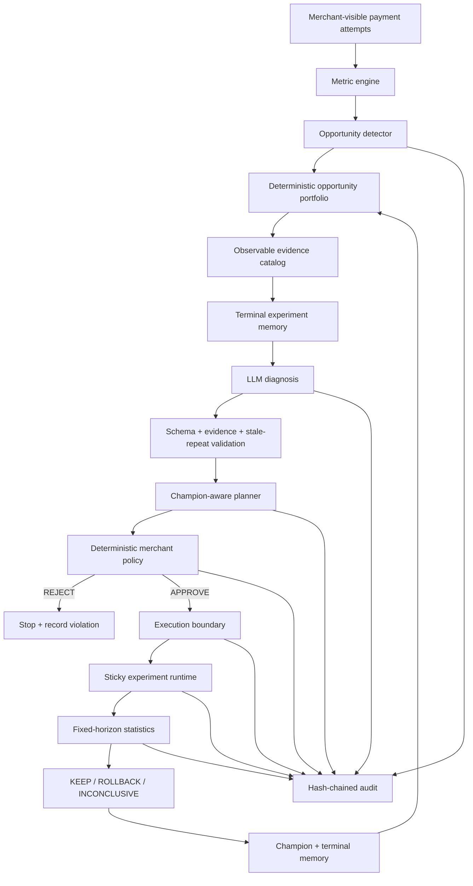

# Trust and Adaptive Architecture

Merchant Revenue Autopilot keeps probabilistic reasoning separate from authorization, execution, and statistical decision-making. The adaptive layer adds structured experiment memory, deterministic prioritization, and champion–challenger behavior without moving those control boundaries into the LLM.

## Control flow



## Observation and prioritization

The production path sees merchant-visible evidence only. The sealed causal model is isolated to the synthetic evaluation harness.

The detector decides whether a segment conversion divergence exists. The portfolio then ranks only untouched detected opportunities using observable gap, affected volume, captured average order value, merchant-policy feasibility, and previous terminal-trial count. A partially started lifecycle always resumes before a new candidate is considered.

The history adjustment is explicit:

```text
history_factor = 1 / (1 + prior_terminal_trials)
```

Any GMV value produced by this layer is an opportunity-sizing proxy, not a revenue forecast or causal uplift claim.

## Structured experiment memory

Merchant learning is reconstructed from canonical persisted records rather than a separate conversational or vector memory store. Terminal experiment, policy, statistical-result, resource, opportunity, and hypothesis records provide the source of truth. Active work is excluded until it reaches a safe terminal state.

The LLM receives compact prior trial context for the affected segment. Deterministic code then validates the new proposal after structured-output and evidence checks.

- exact previously policy-rejected proposals remain blocked;
- exact previous ROLLBACK/INCONCLUSIVE proposals are blocked when observable evidence has not materially changed;
- reconsideration can occur only after explicit material evidence change, including a >=2 percentage-point rate movement or sufficiently large new segment observations.

One bounded corrective diagnosis attempt is permitted when a valid structured proposal is rejected only as a stale repeat. Nothing is persisted until the proposal passes all checks.

## Champion–challenger planning

Champion state is derived from historical statistical KEEP results.

- merchant baseline is Champion v1;
- only KEEP promotes a treatment;
- for the same intervention type, future experiments inherit the promoted champion as control;
- ROLLBACK and INCONCLUSIVE retain the existing champion;
- a challenger identical to its champion is rejected.

This makes the learning loop behavioral rather than a dashboard label.

## Planning and merchant policy

The planner owns experiment structure: control/treatment configuration, treatment exposure, primary metric, guardrails, sample horizon, and duration.

A separate deterministic policy gate checks the complete planned experiment against merchant limits such as intervention allow-list, exposure, discount limits, optional margin rules, observable exposure, sample size, duration, concurrent experiments, segment conflicts, and configuration validity.

Policy returns APPROVE or REJECT. It does not silently rewrite an unsafe proposal into a different approved proposal.

## Execution boundary and duplicate protection

The executor requires a persisted APPROVE decision.

Real mode uses the implemented Razorpay Test Mode client. Hosted demo mode uses an explicitly labelled simulated adapter with `demo_...` resource IDs and makes no Razorpay API request.

Application-level operation keys and canonical request hashes protect external writes. Confirmed successes are recorded; definitive failures are recorded; ambiguous outcomes remain unresolved and are not automatically retried.

## Fixed-horizon statistics

Runtime uses deterministic sticky assignment. Interim p-values do not trigger early stopping.

At the fixed horizon:

```text
p < 0.05 and absolute lift >= +0.02  -> KEEP
p < 0.05 and absolute lift <= -0.02  -> ROLLBACK
otherwise                            -> INCONCLUSIVE
```

The LLM does not participate in the statistical decision.

Terminal results feed structured memory. KEEP alone advances champion state.

## Audit boundary

Meaningful merchant lifecycle events are linked per merchant with SHA-256 hashes. The audit history covers detection, diagnosis, planning, policy, execution, runtime, statistics, rollback, and treatment promotion. The frontend verifies and displays chain integrity.

This provides application-level tamper evidence; it is not a blockchain claim.

## Repeatable cycles

Starting another optimization cycle preserves prior opportunities, experiments, policy decisions, resources, results, payment attempts, learned memory, and audit events.

A partially started or deployed cycle cannot be skipped. If an untouched detected candidate exists, the deterministic portfolio may select it. Otherwise a fresh deterministic detection can create the next opportunity.

## Merchant Intelligence

`GET /api/v1/merchants/{merchant_id}/intelligence` is a read-only projection over:

- opportunity portfolio
- KEEP-derived champion state
- terminal experiment memory

The frontend exposes these on `/intelligence`; React does not recompute the underlying learning or ranking decisions.

## Hosted topology

```text
Browser
  -> Vercel Next.js frontend
  -> Render FastAPI backend
       -> Supabase PostgreSQL
       -> OpenAI-compatible LLM endpoint
       -> real Razorpay Test Mode client OR explicit simulated demo adapter
```

## Task 20 production verification

The final adaptive verification started with two terminal trials and Champion v1. No untouched opportunity existed before rollover, so the next cycle came from fresh deterministic detection.

The guarded hosted journey verified memory-aware diagnosis, champion-control planning, policy authorization, simulated execution, active-cycle rollover protection, fixed-horizon evaluation, learning persistence, and audit integrity.

The third cycle ended INCONCLUSIVE. Trial count advanced from 2 to 3 while Champion correctly remained v1 because no KEEP occurred.

See [`PRODUCTION_VERIFICATION.md`](PRODUCTION_VERIFICATION.md) for the exact evidence.
