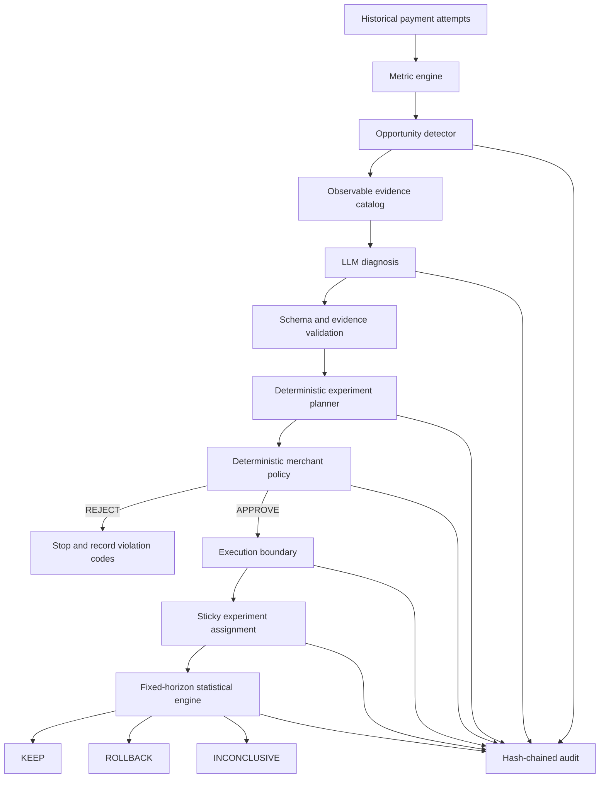

# Trust Architecture

Merchant Revenue Autopilot is designed around one rule: the LLM can propose a commercial action, but it cannot authorize, execute, or judge that action by itself.

## Control flow



## Boundary 1: observation vs hidden evaluation world

The detector and LLM receive merchant-visible evidence only. The sealed causal model is not imported by the production decision path.

The benchmark selects each strategy before any hidden causal outcome is scored. Only the evaluation harness accesses the frozen causal model after strategy selection. This prevents the benchmark from handing the answer to Autopilot.

## Boundary 2: LLM vs deterministic code

The LLM returns a structured `HypothesisProposal` containing:

- hypothesis text
- intervention type
- intervention parameters
- confidence label
- reasoning summary
- evidence references

Deterministic validation rejects unsupported intervention parameters and references to evidence keys not present in the catalog.

The model cannot emit raw Razorpay request JSON and cannot invoke the payment client.

## Boundary 3: planning vs authorization

The planner controls traffic split, metric, guardrails, minimum sample size, duration, and canonical control/treatment configuration.

Merchant policy is a separate deterministic gate. It checks:

- intervention allow-list
- treatment exposure
- discount limits
- optional margin constraints
- observable financial exposure
- minimum sample
- maximum duration
- concurrent experiment limit
- segment conflicts
- treatment configuration validity

The policy engine returns `APPROVE` or `REJECT`. It never silently clamps an unsafe proposal into a different experiment.

## Boundary 4: authorization vs execution

The executor refuses deployment without an approved policy decision.

Real mode calls Razorpay Test Mode through a thin HTTP client. Hosted demo mode uses an explicit simulated adapter and produces IDs in the `demo_...` namespace. The UI labels those resources as simulated and states that no Razorpay request was made.

## Boundary 5: external write ambiguity

Orders and Payment Links do not rely on a fabricated generic Razorpay idempotency header. The application uses an `operation_executions` ledger with a unique operation key.

For real external writes:

- a confirmed success records the resource
- a definitive client failure records failure
- a timeout, transport failure, or ambiguous server failure remains unresolved
- the system does not automatically retry an unresolved write

This favors duplicate prevention over pretending an uncertain write did not happen.

## Boundary 6: experiment vs decision

Runtime traffic uses deterministic sticky assignment.

The system does not show or use interim p-values to stop early. Evaluation waits for the fixed sample horizon.

The statistical engine uses a two-proportion z-test and practical lift threshold:

```text
p < 0.05 and absolute lift >= +0.02  -> KEEP
p < 0.05 and absolute lift <= -0.02  -> ROLLBACK
otherwise                            -> INCONCLUSIVE
```

The LLM is not called during the statistical decision.

## Boundary 7: lifecycle vs audit

Merchant-visible lifecycle events are append-only at the application layer and linked with SHA-256 hashes per merchant.

The audit chain covers detection, diagnosis, hypothesis, planning, policy, execution, runtime, statistics, and rollback. The frontend verifies and displays chain integrity.

This is tamper evidence for the application demo, not a blockchain or distributed-ledger claim.

## Deployment topology

```text
Browser
  |
  | HTTPS
  v
Vercel Next.js frontend
  |
  | HTTPS
  v
Render FastAPI backend
  |
  +--> Supabase PostgreSQL
  |
  +--> OpenAI-compatible LLM endpoint
  |
  +--> Execution mode
       |-- real: Razorpay Test Mode API
       `-- simulated: local hosted-demo adapter
```

## Why the architecture matters

A growth agent is risky if the same probabilistic component proposes a financial action, decides whether it is allowed, performs the write, and declares itself successful. Revenue Autopilot separates those responsibilities so each high-impact transition can be inspected and tested independently.
